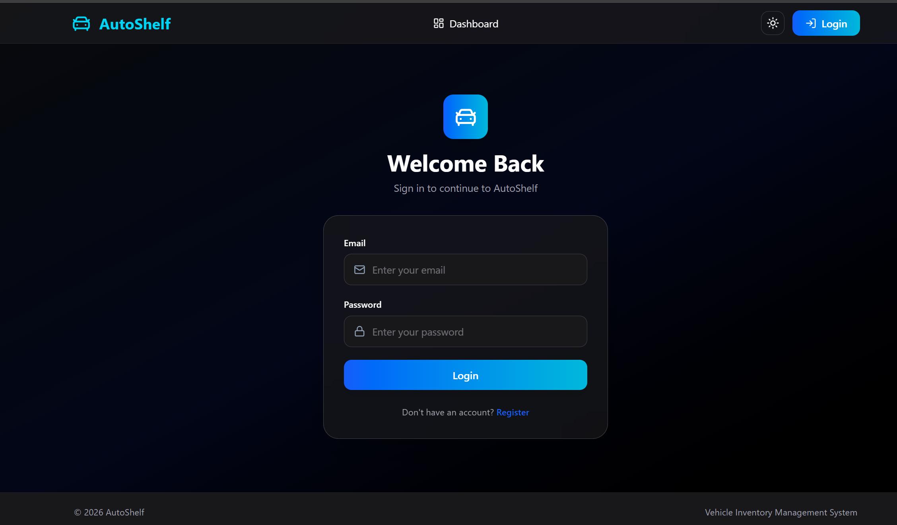
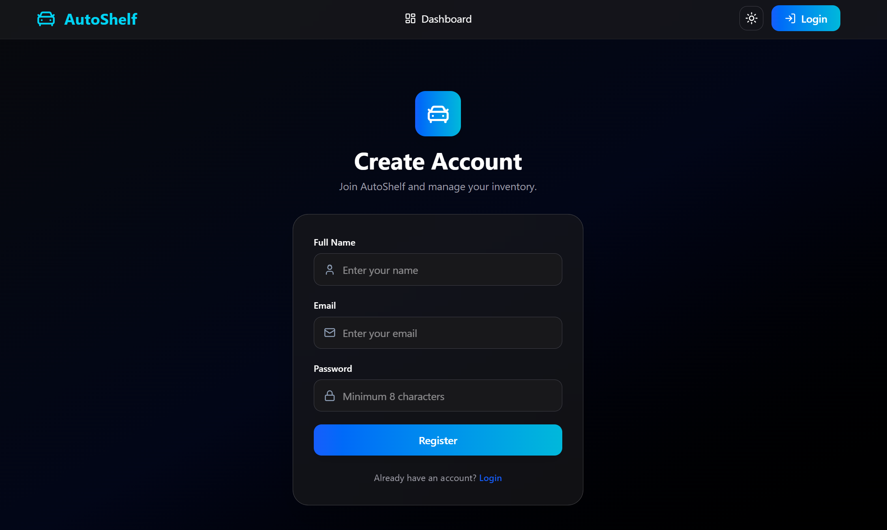
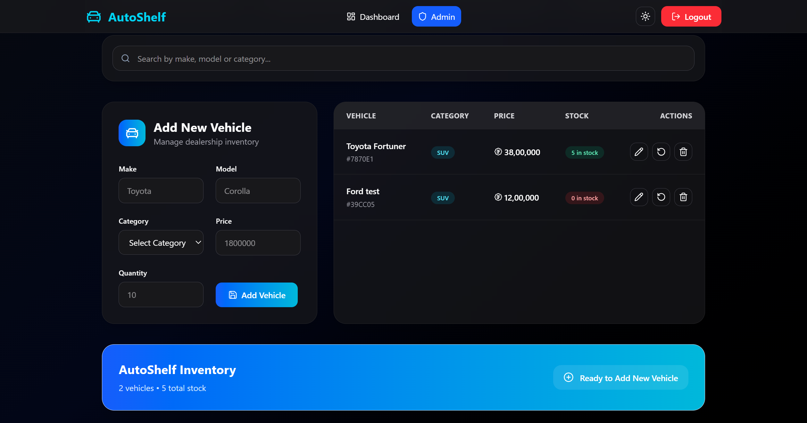
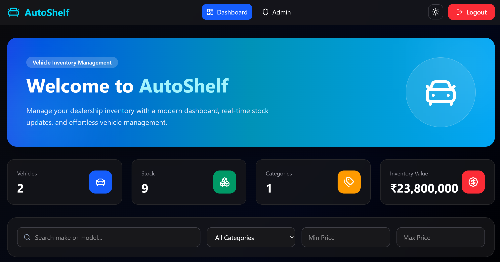
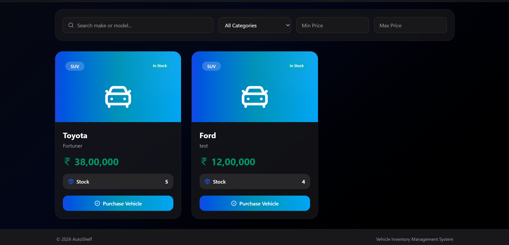
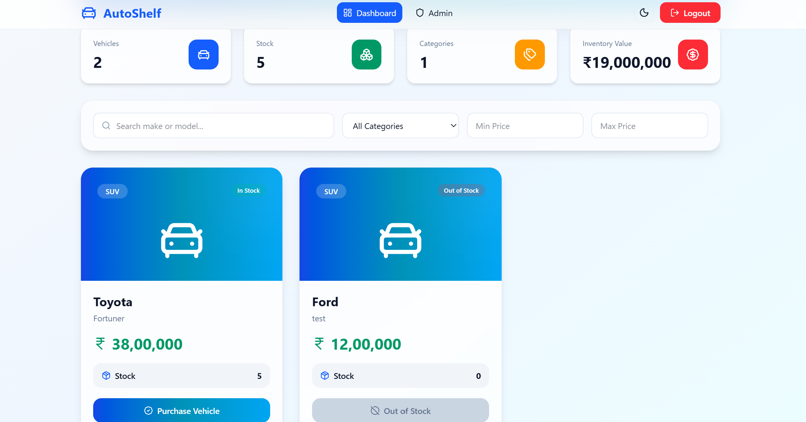

# Car Dealership Inventory System

## Installation & Local Setup

### Prerequisites

Make sure the following are installed:

- Node.js (v18 or later)
- npm
- MongoDB Atlas account (or local MongoDB)
- Git

---

### Clone the Repository

```bash
git clone <repository-url>
cd AutoShelf
```

---

## Backend Setup

Navigate to the backend folder.

```bash
cd backend
```

Install dependencies.

```bash
npm install
```

Create a `.env` file.

```env
PORT=5000
MONGO_URI=your_mongodb_connection_string
JWT_SECRET=your_jwt_secret
```

Start the backend server.

```bash
npm run dev
```

The backend will start at:

```
http://localhost:5000
```

---

## Frontend Setup

Open another terminal.

```bash
cd frontend
```

Install dependencies.

```bash
npm install
```

Create a `.env` file.

```env
VITE_API_URL=http://localhost:5000/api
```

Start the frontend.

```bash
npm run dev
```

The frontend will be available at:

```
http://localhost:5173
```

---

## Running Backend Tests

Navigate to the backend directory.

```bash
cd backend
```

Run the test suite.

```bash
npm test
```

All Jest test cases should pass successfully.

## Test Report
``` bash

npm test


Test Suites: 10 passed, 10 total
Tests:       13 passed, 13 total
Snapshots:   0 total
Time:        20.292 s, estimated 23 s
Ran all test suites.

```

## screenshots

### Login



### Register




### Admin Dashboard



### dashboard 






# My AI Usage

## AI Tools Used

- ChatGPT (OpenAI)

---

## How I Used AI

AI was used as a development assistant throughout the project rather than as a replacement for implementation or decision-making.

Specifically, I used ChatGPT for:

- Brainstorming the backend folder structure and project architecture.
- Discussing REST API design and endpoint organization.
- Reviewing code for readability and suggesting refactoring opportunities after functionality was complete.
- Explaining concepts related to JWT authentication, middleware, and testing.
- Assisting in creating Jest and Supertest test cases while following a Test-Driven Development (TDD) workflow.
- Helping identify and debug issues encountered during development.
- Suggesting improvements for frontend UI layout, responsiveness, and component organization.
- Assisting in writing project documentation, including this README.

All generated suggestions were reviewed, modified where necessary, tested locally, and integrated manually into the project.

---

## Reflection

Using AI significantly improved my development workflow by reducing the time spent researching implementation details and debugging issues. It allowed me to focus more on understanding the architecture, implementing features, and improving code quality rather than searching for syntax or boilerplate examples.

AI was most valuable as a learning and productivity tool. It helped explain concepts, suggest alternative approaches, and identify potential improvements, while the final implementation decisions, integration, testing, and validation remained my responsibility.

Overall, AI accelerated development without replacing the need to understand, verify, and maintain the codebase.